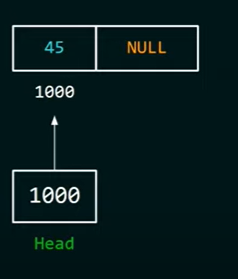

# Linked List by [Neso Academy](https://www.youtube.com/watch?v=R9PTBwOzceo&list=PLBlnK6fEyqRi3-lvwLGzcaquOs5OBTCww&index=1)

## Linked List Types

### Single Linked List

Navigation is forward only.

### Double Linked List 

Forward and backward navigation is possible.

### Circular Linked List

Last element is linked to the first element.

## Single linked list structure:

the main element that a linked list is made of is **Node**

### Node consists of

#### Data

 has the actual data 

#### Link

is a pointer points to the next node

**Example:**
suppose, we want to store a list of numbers: 23,54,78,90


in this example you can see that you have 4 elements in each one of them there is the data you need to store, and there is a pointer to the next element
notice two things:
1- the address of which the pointers points to is not sequential
2- there is a special pointer in the Single linked list called "**Head**" and it's supposed to tell the first place of the linked list

## What is the difference between linked list and array?

say that we want to store a list of numbers: 23, 54, 78, 90

in an **array** it will look like:


notice that the **address** in which the elements are stored in are **sequential** (1000-1004-1008-1012).

in a **linked list** it will look like:


notice two things:
1- the address of which the pointers points to is not sequential.
2- there is a special pointer in the Single linked list called "**Head**" and it's supposed to tell the first place of the linked list.

## How to create a single linked list?

first you need to make a **self referential structure** which is a structure that contains a pointer to a structure of the same type.

```c
struct node
{
int data;           // you can have multiple data
char data2;
.
.
.
struct node *link; // you must have a single ptr
}
```


now write a code for the following simple single linked list 
**Exercise 1:**



```c
#include <stdio.h>
#include <stdlib.h>
struct node 
{
int data;
struct node *link;
};

int main ()
{
/*-=creating the head ptr and the first node=-*/
struct node *head = NULL;        //creating a head ptr of the type node
head = (struct node *) malloc(sizeof(struct node));  // allocating memory for the first element 
head->data = 45;  // accessing the node's data through the head pointer & initializing it
head->link = NULL; // accessing the node's link through the head pointer & initilizing it
/*-----------------------------------------*/

printf ("%d", head-> data);
return 0;
}
```

**Exercise 2:** create the following linked list.


```C
#include <stdio.h>
#include <stdlib.h>

struct node
{
int data;
struct node *link;
};

int main ()
{
/*-=creating the head ptr and the first node=-*/
struct node *head = NULL;
head = (struct node *) malloc (sizeof(struct node));
head->data =45;
head->link = NULL;
/*-----------------------------------------*/

/*-=creating the current ptr and the 2nd node=-*/
struct node *current = NULL;
current = (struct node *) malloc (sizeof(struct node));
current->data= 98;
current->link= NULL;
/*-----------------------------------------*/

/*Linking the first node with the 2nd node*/
head->link = current;
/*-----------------------------------------*/

/*-=creating the 3rd node=-*/
current = (struct node *) malloc (sizeof(struct node));
current->data = 3;
current->link = NULL;
/*-------------------------*/

/*Linking the 2nd node with the 3rd node*/
head->link->link = current;
/*--------------------------------------*/

return 0;
}
```

## How to transverse a single linked list?

### Counting the node

**Exercise 3:** 

```c
#include <stdio.h>
#include <stdlib.h>

struct node 
{
	int data;
	struct node *link;
};

count_of_nodes(struct node *head)
    {
		int count = 0;
		if (head == NULL)
		{
			printf("Linked List is empty");
		}
		else 
		{
			struct node *ptr = NULL;
			ptr=head;
            while (ptr != NULL)
            {
                count++;
                ptr= ptr->link;
            }
            printf("%d", count);
		}
    }

int main ()
{

}
```

**Exercise 4:**

### printing all the data of the linked list

```c
#include <stdio.h>
#include <stdlib.h>

struct node
{
    int data;
    struct node *link;
};

void print_data(struct node *head)
{
    if(head == NULL)
    {
        printf("the linked list is empty");
    }
    else 
    {
        struct node *ptr = NULL;
        ptr = head;
        while (ptr != NULL)
        {
            printf("%d", ptr->data);
            ptr = ptr->link;
        }
    }
}
int main ()
{
	
}
```

## What is the difference in transverse an array and a linked list ?


**Linked List:**
Counting elements -> Time Complexity: O(n)
Printing data -> Time Complexity: O(n)
**Array**:
Counting elements -> Time Complexity: O(1)
Printing data -> Time Complexity: O(n)

**Counting the elements of array code:**

```c
#include <stdio.h>
int main ()
{
    int arr[]= {45,98,3};
    int n;
    n = sizof(arr)/sizeof(int);
    printf("%d",n);
    return 0;
}
```

**Printing the data of an array:**

```c
#include <stdio.h>
int main ()
{
    int arr[]= {45,98,3};
    int n, i;
    n = sizeof (arr)/sizeof(int);
    for(i=0; i<n ; i++)
    {
        printf("%d", arr[i]);
    }
    return 0;
}
```

## How to insert a node at the end of the linked list?


```C
void add_at_end (struct node *head, int data)
{
    struct node *ptr, *temp;
    ptr = head;
    temp = (struct node*) malloc(sizeof(struct node));

    temp->data = data;
    temp->link = NULL;

    while (ptr->link != NULL)
    {
        ptr = ptr->link;
    }
    ptr->link = temp;
}
```

this code ptr is being incremented till it reaches the end of the linked list, then it adds this data.

this function will take **time complexity** is O(n)

another "**تحنيكة مني**" approach

```c
void append_data (struct node * *current, int data)
{
    struct node *temp;
    temp = (struct node *)malloc(sizeof(struct node));

    temp -> data = data;
    temp -> link = NULL;

    (*current) ->link = temp;
    *current = temp;
}
```

this code requires a **current** pointer points at the last node of the linked list 

I pass the current pointer by pointer to be able to take it's value by refrence so i can increment the current pointer after appending elements to the linked list 

this function **time complexity** is O(1)

another "**تحنيكة منه**" approach 

```c
struct node * add_at_end (struct node *ptr, int data)
{
	struct node *temp;
	temp = (struct node *)malloc (sizeof(struct node));
	temp->data = data;
	temp->link = NULL;

	ptr->link = temp;
	return temp;
}
```

the difference between his "**تحنيكة**" and my  "**تحنيكة**" 

in his "**تحنيكة**" he must update the ptr in the main 

```C
ptr = add_at_end(ptr, 98);
```

but in my "**تحنيكة**"

you don't need to update (increment) the pointer value in main
however you need to pass the address of head ptr

```
add_at_end(&ptr, 98);
```


_______
SKIP ARRAY VS LL 

____


## How to insert Node at the beginning of the linked list?

```c
struct node* add_beg(struct node* head, int data)
{
	struct node *ptr = malloc(sizeof(struct node));
	ptr->data = data;
    ptr->link = head;
    head = ptr;
	return head;
}
```

 **Time Complexity** is O(1)

pass by refrence approach 

```
void add_beg(struct node **head, int d)
{
struct node *ptr = malloc (sizeof (struct node));
ptr->data = d;
ptr->link = NULL;

ptr->link = *head;
*head = ptr;
}	
```

## How to insert Node at a specific position in the linked list?


answer 


```c
void add_at_pos(struct node *head,int data,int position)
{
    struct node *ptr;
    struct node *temp = (struct node *)malloc(sizeof(struct node));
    temp->data = data;
    temp->link = NULL;
    ptr = head;

    int i; 
    for (i=0 ; i<position-1 ; i++)
    {
        ptr = ptr->link;
    }
    temp -> link = ptr -> link;
    ptr ->link = temp;

}
```

## How to delete first node ?

```c
struct node* del_first(struct node *head)
{
    if(head == NULL)
        printf("List is already empty!");
    else     
    {
        struct node *temp = head;
        head = head->link;
        free(temp);
        temp = NULL;
    }
    return head;
}

int main ()
{
head= del_first(head);
}
```

## How to delete last node ?(Using 2 ptrs)

```c
struct node* del_last(struct node *head)
{

    if(head == NULL)
        printf("List is already empty!");
    else if (head->link = NULL)
    {
        free(head);
        head = NULL;
    }    
    else     
    {
        struct node* temp = head;
        struct node* temp2 = head;
		while (temp->link != NULL)
        {
            temp2 = temp;
            temp = temp->link;
        }
        temp2->link = NULL;
        free(temp);
        temp = NULL;
    }
    return head;
}
```


## How to delete last node ?(Using 1 ptrs)

```c
struct node* del_last(struct node *head)
{

    if(head == NULL)
        printf("List is already empty!");
    else if (head->link = NULL)
    {
        free(head);
        head = NULL;
    }    
    else     
    {
        struct node* temp = head;
		while (temp->link->link != NULL)
        {
            temp = temp->link;
        }
        free(temp);
        temp->link = NULL;
        temp = NULL;
    }
    return head;
}
```

what is the problem with this code?
`temp->link` becomes a **dangling** ptr before `temp->link = NULL;`

## How to delete a node in a particular position in Linked list ?(Using 2 ptrs)

```c
struct node* del_node(struct node *head, int position)
{
    if(head == NULL)
    {
        printf("List is already empty!");
        return NULL;
    }    
    else if (position == 0)
    {
        struct node *temp = head;
        head = head->link;
        free(head);
        return head;
    }    
    else     
    {
        struct node* prev = head;
        struct node* curr = head;

        int i = 0;
        for (i=1 ; curr != NULL && i < position; i++)
        {
            prev = curr;
            curr = curr->link;
        }

        if (curr == NULL)
        {
            printf("position out of boundry\n");
            return head;
        }

        prev->link = curr->link;
        free(curr);

        curr = NULL;
        prev = NULL;

        return head;
    }
}
```

**the videos approach** 

```

```


## How to delete a whole linked list ?

```c
struct node *del_LL(struct node* head)
{
	struct node *temp = head;
    while (temp!= NULL)
    {
        temp = temp-> link;
        free(head);
        head = temp;
    }
return head;
}
```

## How to reverse a linked list?


```c
struct node* reverse (struct node *head)
{
    struct node *prev = NULL;
    struct node *next = NULL;

    while (head != NULL)
    {
        next = head->link;
        head->link = prev;
        prev = head;
        head = next;
    }
    head = prev;
    return head;
}
```

**a trick to remeber this code** 
1- first you need to remember that you need 3 pointer (next, head, prev.)
2- initialize the next and prev pointer
3- remember this sequence **(next, head -> link, prev, head, next)**

```c
while(head !=NULL)
{	
	next = head->link;
	head->link = prev;
	prev = head;
	head = next;
}
```

4- head = prev; 
5- return head;

